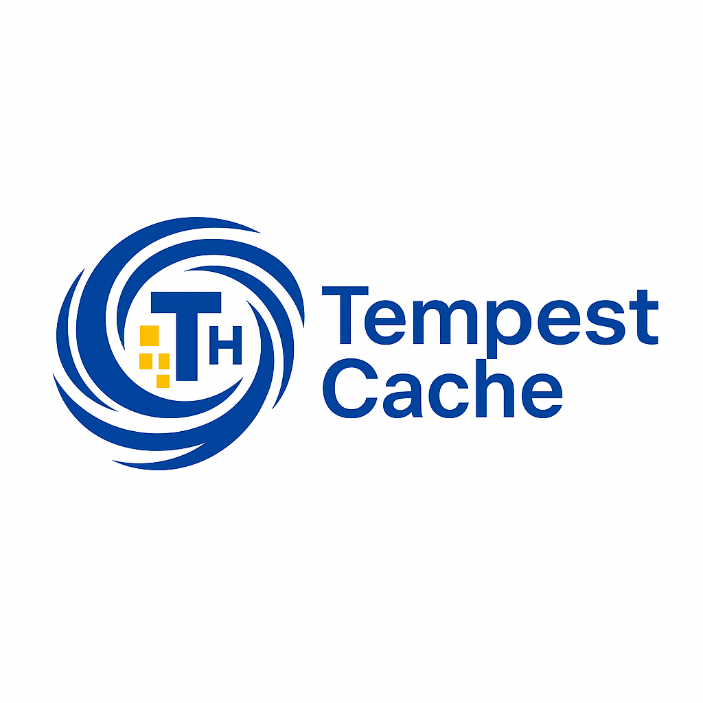

# TempestCache


TempestCache: Adaptive Cache Intelligence for the Modern Data Storm

##### A Lightweight, Pattern-Aware Cache Framework with Coordinated Hot Data Management
**TempestCache** is a lightweight, pattern-aware cache optimization framework for modern multi-core systems. It integrates frequency decay, pattern detection, and prefetch-LRU coordination for adaptive memory management.



## 🔍 Key Features

- **Time-decayed frequency tracking** using Q4.4 fixed-point arithmetic
- **Access pattern classification** (Hot / Periodic / Normal) with just 4–8 history entries
- **Temporary-Hot (T-H) tagging** for coordinated prefetch and replacement
- **Multi-bank memory support** for scalable cache partitioning

## 🏗 Code Structure

```bash
TempestCache/
├── rtl/                    # Verilog/SystemVerilog modules
│   ├── cache_core.sv
│   ├── freq_tracker.sv
│   ├── pattern_detector.sv
│   └── th_tag_logic.sv
├── sim/                    # Simulation & testbench (Verilog)
│   ├── testbench.sv
│   └── mem_trace.vmh
├── scripts/                # Helper scripts for synthesis or automation
│   ├── run_sim.sh
│   └── analyze.vcs.tcl
├── py_model/               # Python reference model
│   ├── cache_model.py
│   ├── pattern_tracker.py
│   └── visualize.py
├── benchmarks/             # Benchmark traces
│   ├── spec06/
│   ├── mibench/
│   └── polybench/
├── docs/
│   ├── README.md
│   └── TempestCache_whitepaper.pdf
└── LICENSE
