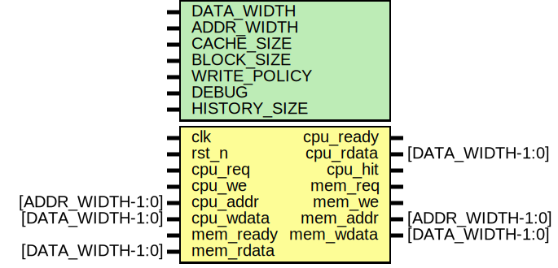

# Entity: dcache 
- **File**: dcache.v

## Diagram

## Generics

| Generic name | Type | Value | Description |
| ------------ | ---- | ----- | ----------- |
| DATA_WIDTH   |      | 32    |             |
| ADDR_WIDTH   |      | 32    |             |
| CACHE_SIZE   |      | 1024  |             |
| BLOCK_SIZE   |      | 16    |             |
| WRITE_POLICY |      | 0     |             |
| DEBUG        |      | 1     |             |
| HISTORY_SIZE |      | 4     |             |

## Ports

| Port name | Direction | Type             | Description |
| --------- | --------- | ---------------- | ----------- |
| clk       | input     |                  |             |
| rst_n     | input     |                  |             |
| cpu_req   | input     |                  |             |
| cpu_we    | input     |                  |             |
| cpu_addr  | input     | [ADDR_WIDTH-1:0] |             |
| cpu_wdata | input     | [DATA_WIDTH-1:0] |             |
| cpu_ready | output    |                  |             |
| cpu_rdata | output    | [DATA_WIDTH-1:0] |             |
| cpu_hit   | output    |                  |             |
| mem_req   | output    |                  |             |
| mem_we    | output    |                  |             |
| mem_addr  | output    | [ADDR_WIDTH-1:0] |             |
| mem_wdata | output    | [DATA_WIDTH-1:0] |             |
| mem_ready | input     |                  |             |
| mem_rdata | input     | [DATA_WIDTH-1:0] |             |

## Signals

| Name                   | Type                                                                                                                                                  | Description |
| ---------------------- | ----------------------------------------------------------------------------------------------------------------------------------------------------- | ----------- |
| history_ptr [NUM_SETS] | logic [3:0]                                                                                                                                           |             |
| state                  | enum logic [1:0] { IDLE,  WRITE_BACK,  FILL} |             |
| next_state             | enum logic [1:0] { IDLE,  WRITE_BACK,  FILL} |             |
| tag                    | logic [TAG_BITS-1:0]                                                                                                                                  |             |
| index                  | logic [INDEX_BITS-1:0]                                                                                                                                |             |
| offset                 | logic [OFFSET_BITS-1:0]                                                                                                                               |             |
| way_hits               | logic [NUM_WAYS-1:0]                                                                                                                                  |             |
| hit                    | logic                                                                                                                                                 |             |
| way_idx                | integer                                                                                                                                               |             |
| current_way            | integer                                                                                                                                               |             |
| i                      | integer                                                                                                                                               |             |
| j                      | integer                                                                                                                                               |             |

## Constants

| Name        | Type | Value                             | Description |
| ----------- | ---- | --------------------------------- | ----------- |
| NUM_WAYS    |      | 4                                 |             |
| NUM_SETS    |      | CACHE_SIZE/(BLOCK_SIZE*NUM_WAYS)  |             |
| OFFSET_BITS |      | (BLOCK_SIZE)                      |             |
| INDEX_BITS  |      | (NUM_SETS)                        |             |
| TAG_BITS    |      | ADDR_WIDTH-INDEX_BITS-OFFSET_BITS |             |

## Types

| Name            | Type                                                                                                                                                                                                                                                                                                                                                                                                                                          | Description |
| --------------- | --------------------------------------------------------------------------------------------------------------------------------------------------------------------------------------------------------------------------------------------------------------------------------------------------------------------------------------------------------------------------------------------------------------------------------------------- | ----------- |
| cache_line_t    | struct packed {           logic valid;                           logic dirty;                           logic [TAG_BITS-1:0] tag;              logic [DATA_WIDTH-1:0] data;            logic [1:0] access_type;           } |             |
| history_entry_t | struct packed {           logic [TAG_BITS-1:0] tag;              logic [INDEX_BITS-1:0] index;            logic valid;                       }                                                                                                                                                    |             |
| lru_bits_t      | logic [NUM_WAYS*NUM_WAYS-1:0]                                                                                                                                                                                                                                                                                                                                                                                                                 |             |

## Functions
- find_lru_way (logic [NUM_WAYS*NUM_WAYS-1:0] lru) return (integer)
- update_lru (lru_bits_t lru,  input integer way) return (lru_bits_t)
- detect_pattern (input history_entry_t history[HISTORY_SIZE) return (logic [1:0])
- select_victim (input cache_line_t ways[N) return (integer)

## Processes
- unnamed: (  )
  - **Type:** always_comb
- unnamed: ( @(posedge clk or negedge rst_n) )
  - **Type:** always_ff
